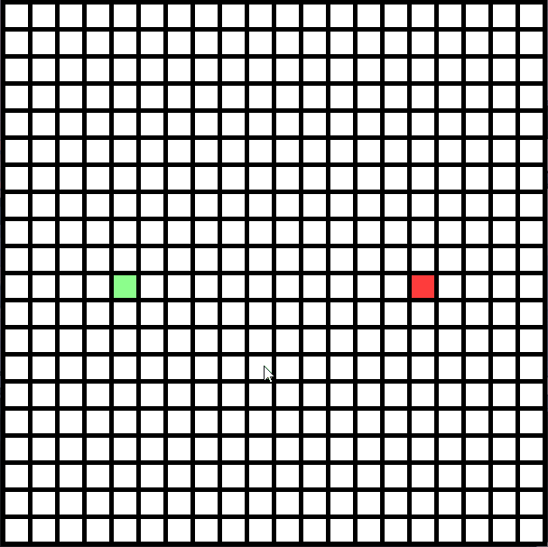
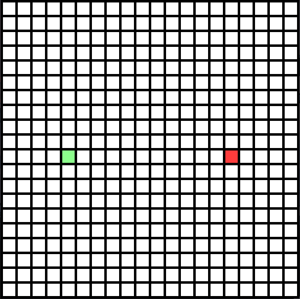

# A* visualizer
A graphical visualizer for finding the shortest path between two points using the A* algorithm


## Installation
To use, download the .zip and extract the contents, or clone the repository by typing

```bash
git clone https://github.com/idankap/a-star-visualizer.git
```

### Requirements
- Python 3.x
- Pygame
- Numpy

## Usage
First start the program by running the main.py file and then

You can draw and erase walls by clicking the left mouse button on empty cells to draw and on walls to erase them


You can move the start and end by selecting and dragging them with the left mouse button


You can switch whether you want the algorithm to search in diagonals also or not by pressing T on the keyboard
And to start the algorithm just press SPACE on the keyboard


## License
Licensed under the [MIT License](https://opensource.org/licenses/MIT)
